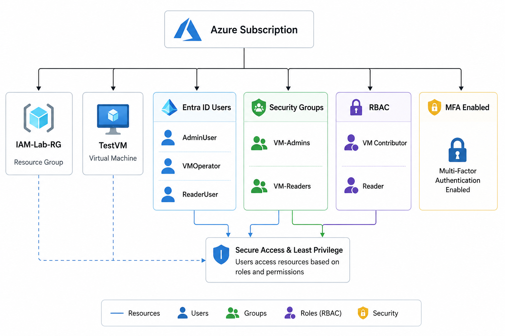

# Azure Identity & Access Management Lab

## Overview

This project demonstrates Azure Identity and Access Management (IAM) using Microsoft Entra ID, Security Groups, and Role-Based Access Control (RBAC).

## Architecture

## Services Used

- Microsoft Entra ID
- Azure RBAC
- Azure Virtual Machine
- Resource Groups
- Security Groups

## Project Objectives

- Create Entra ID Users
- Create Security Groups
- Assign Users to Groups
- Configure RBAC Roles
- Apply Least Privilege Access

## Environment

| Resource | Name |
|-----------|--------|
| Resource Group | IAM-Lab-RG |
| Virtual Machine | TestVM |
| Security Group | VM-Admins |
| Security Group | VM-Readers |

## Users

| User | Purpose |
|--------|---------|
| AdminUser | Administrator |
| VMOperator | VM Operations |
| ReaderUser | Read Only Access |

## Security Groups

| Group | Members |
|---------|----------|
| VM-Admins | AdminUser, VMOperator |
| VM-Readers | ReaderUser |

## RBAC Assignments

| Group | Role |
|---------|--------|
| VM-Admins | Virtual Machine Contributor |
| VM-Readers | Reader |

## Screenshots

Available inside Screenshots folder.

## Skills Demonstrated

- Azure Administration
- Microsoft Entra ID
- Identity Management
- Role-Based Access Control (RBAC)
- Access Governance
- Least Privilege Principle

## Author

Praveen Kumar
